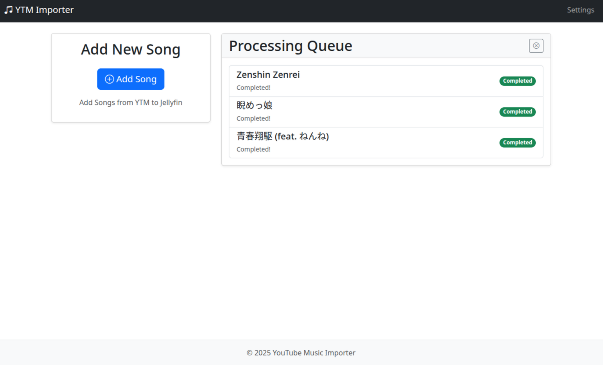

# Octofin

Octofin is a set of tools and scripts that adds QoL functionality to your jellyfin music library.

## 1. YTM Importer

Octofin has a youtube music downloader that will download tracks from youtube music and add to your music library.



### Setup

Create a file called `.env` and add the following details to it:

```sh
PO_TOKEN=YOUR_PO_TOKEN
COOKIES_PATH=PATH_TO_COOKIES
OCTO_OUTPUT_DIR=OUTPUT_DIRECTORY
```

The `docker-compose.yml`:

```yml
services:
  web:
    image: sortedcord/octofin
    ports:
      - "8193:8193"
    env_file:
      - .env
    volumes:
      - ./path_to_music_library:/data
    restart: unless-stopped
```

After creating the file with all the environment variables, you can build the docker container and run it:

```sh
$ docker-compose up --build
```

The downloader should now be accessible at `http://localhost:8193`